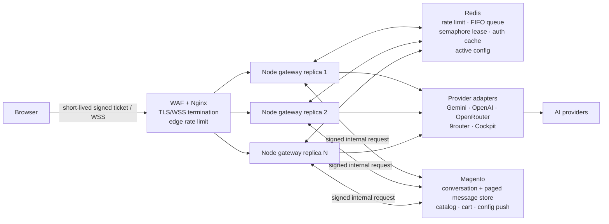

# Afd_AI scalable gateway

`Afd_AI` uses the Node gateway as the only provider execution path. Magento owns customer/session data and provider configuration; it never exposes a provider key to the browser.

## Required production properties

- Run at least three Node replicas behind a TLS/WSS reverse proxy and WAF.
- Set `REDIS_URL`; production startup fails without it. `ALLOW_IN_MEMORY_STATE=true` is local/test only.
- Use the same `AI_NODE_SYNC_SECRET` and `AI_WS_TICKET_SECRET` on Magento and every gateway replica. Both must be at least 32 characters.
- Magento issues a one-minute, single-use WebSocket ticket. The browser never passes a Magento customer token or provider key to Node.
- Redis enforces the rate limit, FIFO waiting queue and model semaphore globally, so adding replicas does not multiply provider cost.
- Redis also holds renewable global and per-network WebSocket admission leases. The bundled Nginx edge must be the trusted proxy (`TRUST_PROXY=1`); direct gateway exposure must leave it disabled so clients cannot spoof `X-Forwarded-For`.
- Set a private `AI_METRICS_TOKEN` and expose `/internal/metrics` only to monitoring.
- Magento is the sole system of record for conversations and messages. The gateway reads message history through cursor pagination, so it never loads an unbounded transcript.

## Deployment

1. Copy `.env.gateway.example` to the deployment secret store and provide real values.
2. Configure Magento `afd_ai/general/chat_server_url` to a same-origin URL such as `wss://shop.example.com/ai-gateway/`. This preserves the store CSP `connect-src 'self'` policy. A separate gateway hostname must be added explicitly to `etc/csp_whitelist.xml` before deployment.
3. Magento generates and protects the two gateway secrets. On the Magento host, run `bin/magento afd:ai:gateway:credentials`, then set the printed values on every Node replica as `AI_NODE_SYNC_SECRET` and `AI_WS_TICKET_SECRET` before its first configuration sync.
4. Build and run `docker compose --env-file .env.gateway up -d --build` from `ai-chat-server`.
5. Save Afd AI configuration in Magento Admin; the successful status means the selected replica wrote the active configuration to Redis for all replicas.
6. Load `infra/nginx/production-upstream.conf.example` in Nginx `http {}` context, then add `production-wss.conf.example` behind the approved WAF/CDN.

## Capacity test gate

Do not call this 1,000-user ready until a staging load test proves all of the following:

- 1,000 WebSocket connections remain established through the proxy.
- Global model concurrency never exceeds `MAX_CONCURRENT_MODEL_REQUESTS`.
- Queue-full and queue-timeout responses return `SERVICE_BUSY` and a retry value.
- Killing one replica does not lose rate-limit, queue or config state; reconnecting clients receive a new ticket.
- Metrics show queue depth, active model requests, failures and latency.
